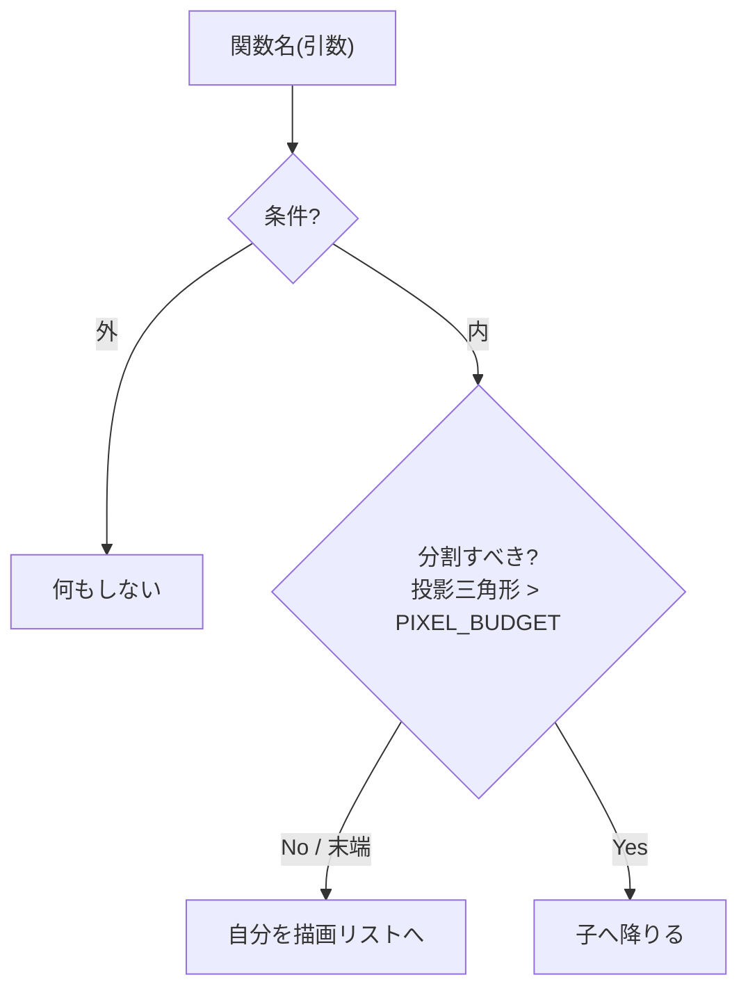
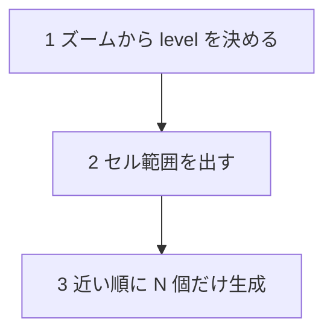

# rich-docs リファレンス

SKILL.md の本筋（3層に振り分けて docs:render で目視確認）を実行するときの、道具ごとの書き方・落とし穴・配色・ツール仕様。詰まったところだけ拾い読みする。

## 目次

- [図の振り分け（具体例つき）](#図の振り分け具体例つき)
- [Mermaid の書き方と落とし穴](#mermaid-の書き方と落とし穴)
- [LaTeX（GitHub/KaTeX）の書き方と落とし穴](#latexgithubkatex-の書き方と落とし穴)
- [SVG の書き方・配色・はみ出し対策](#svg-の書き方配色はみ出し対策)
- [docs:render の仕様](#docsrender-の仕様)

## 図の振り分け（具体例つき）

「どの図をどの道具にするか」で迷ったときの判断例。基準は**「自動レイアウトの関係か（Mermaid）／数式か（LaTeX）／座標を自分で置く幾何か（SVG）」**。

| 例 | 道具 | 理由 |
| --- | --- | --- |
| 関数の判断ツリー（if/else の分岐） | Mermaid `flowchart TD` | ノードと矢印の関係。レイアウトは自動でよい |
| 1フレームの処理の流れ（手順 1→2→3） | Mermaid `flowchart TD` | 直線パイプライン。番号リストより一目で追える |
| 親ノード→子4つの木 | Mermaid `flowchart TD`（`A --> B & C & D & E`） | 木構造は Mermaid の得意分野 |
| `L = log2(BASE / (RES·wpp))` の導出 | LaTeX `$$...$$` | 分数・log・添字は組版しないと読めない |
| 「一辺×½・面積×¼」程度の短い式 | インライン LaTeX `$\times\tfrac12$` | 文中に混ぜる軽い式 |
| 正方形を 2×2 に分割していく格子 | SVG | 座標つきの幾何。Mermaid では描けない |
| 視錐台を横から見た四角錐 | SVG | 空間の図。自由配置が要る |
| LOD 境界のクラックとスカートの断面 | SVG | 断面図。Mermaid 不可 |
| 実際の TS コード・定数定義 | そのまま ``` コード | コードはコード。図化しない |
| 対比表・パラメータ早見表 | そのまま Markdown テーブル | 既に最適な表現 |

## Mermaid の書き方と落とし穴

GitHub はネイティブ描画、VS Code は拡張（"Markdown Preview Mermaid Support" 等）が要る。基本は ` ```mermaid ` フェンスに `flowchart TD`（上→下）。

**判断ツリー（分岐）の型:**

````markdown

````

**直線フロー（手順）の型:**

````markdown

````

**落とし穴（実際に踏んだもの）:**

- **特殊文字を含むラベルは `"..."` で囲む**。`/` `?` `()` `:` などが入るラベルは引用しないとパースが崩れる。エッジラベルも `-->|"No / 末端"|` と引用できる。
- **`>` は `&gt;`** と書く（生 `>` はノード構文と衝突する）。`<` も同様に `&lt;`。
- **改行は `<br/>`**。引用ラベル内で使える。
- **角括弧の入れ子を避ける**。`["... [a, b] ..."]` は壊れやすい。`[a 〜 b]` のように書き換える。
- 矢印で複数の子: `A --> B & C & D`。逆に `A & B --> C` も可。

検証では `npm run docs:render -- <file> --clip .mermaid` で図ごとに焼き、**実際に描画されたか**を Read で見る（構文エラーは図が出ない／壊れる形で現れる。`⚠ mermaid:` の出力も確認）。

## LaTeX（GitHub/KaTeX）の書き方と落とし穴

GitHub も VS Code 組込みプレビューも `$...$`（インライン）/ `$$...$$`（ブロック）をネイティブ描画する。docs:render は KaTeX で焼く。

**ブロック式（複数行可）:**

```latex
$$\frac{\text{BASE\_TILE\_WORLD}}{2^{L}\cdot \text{TILE\_RES}} = \text{worldPerPixel}
\;\Longrightarrow\; L = \log_{2}\!\left(\frac{\text{BASE\_TILE\_WORLD}}{\text{TILE\_RES}\cdot \text{worldPerPixel}}\right)$$
```

**落とし穴:**

- **数式に `_`（アンダースコア）を入れない——GitHub で数式ごと壊れる**（最重要）。GitHub は「markdown→数式」の順で処理し、ソースの `\_` を `_` に戻してから MathJax に渡す。すると `\text{...}`（text mode）内の `_` が **`'_' allowed only in math mode`** で弾かれ、**その数式は描画されず生ソースがそのまま出る**。しかも **`docs:render` は KaTeX で焼くのでこの罠を見逃す**（KaTeX は `\_` を通す＝GitHub の MathJax と挙動が違う。docs:render が緑でも GitHub で確認が要る理由）。対策: `BASE_TILE_WORLD` のような SCREAMING_SNAKE 定数を数式に直書きせず、**短い記号＋凡例**にする（式では $B$ を使い、本文で「$B$ は `BASE_TILE_WORLD`」と添える。定数名はコードスパン \`...\` に置けば下線は安全）。**`\log_2` のような math mode の添字 `_{...}` は問題ない**——壊れるのは `\text{}`/`\mathrm{}` など **text mode 内の下線**だけ。
- **インライン式は `$` のペアが偶数**になるように。1行に複数式（`$a$、$b$、$c$`）でも左から順にペアになるので OK。
- 変数名は `\text{worldPerPixel}` のようにローマン体で。素の `worldPerPixel` はイタリックの積に見える。
- よく使う: `\frac{}{}` 分数 / `2^{L}` 上付き / `\log_{2}` / `\tan` / `\tfrac{1}{2}` 小さい分数 / `\Longrightarrow` 太い矢印 / `\!` 詰め / `\left( \right)` 自動サイズ括弧。
- コードと混同しない: コード片や定数の列挙は ``` のまま。数式として組版する価値があるものだけ LaTeX 化する。

## SVG の書き方・配色・はみ出し対策

幾何図は `docs/assets/*.svg` に置き、`` で参照する（**インライン `<svg>` ではなく**ファイル参照。GitHub のサニタイザに左右されないため）。

**まず「何を伝える図か」を決める。** ASCII を丸写しせず、概念の肝を絵にする。とくに**合成・累積・before→after** を表す図は、部品を並べるだけでなく**合成結果**を必ず描く。例: fBm のオクターブ積み重なりなら、各オクターブの波（低周波・大振幅 → 高周波・小振幅）に加えて、それらを**足し合わせた最終形の波**を1本重ねる。これがないと「ただ波が3本ある」だけで、"重ねると地形になる" という肝が伝わらない。配色は下の中間色パレットで各層を色分けし、合成波は強調色（赤系）にすると関係が読める。

**light/dark 両対応の配色（最重要）** — GitHub も VS Code もテーマを切替える。片方で潰れないよう:

| 用途 | 値 | 方針 |
| --- | --- | --- |
| 線（ストローク） | `#5a9bd4`（中間の青）/ `#888`（グレー） | 純黒・純白を避け、中間の明度に |
| 文字 | `#8b949e`（GitHub muted） | light/dark 両方で読める中間色 |
| 強調・警告 | `#cc6666`（くすんだ赤） | 彩度を抑えた中間色 |
| 塗り | `fill="none"` か半透明 `fill="#5a9bd433"` | 不透明な純色ブロックを置かない |
| フォント | `font-family="sans-serif"` | 環境非依存 |

`<style>` にクラスでまとめると読みやすい。アニメ・`<script>` は入れない（参照 SVG では無効化される）。

**はみ出し対策**: テキストが `viewBox` の右端や下端で切れやすい。`text-anchor="middle"` のラベルは中心 x ±（文字数×約10px/全角）が `viewBox` 幅に収まるか見積もる。収まらなければ **`viewBox` を広げる**か、**ラベルを2行に分ける／短縮する**。`role="img"` と `aria-label` を付けておくと意味が残る。

**確認**: `qlmanage -t -s 900 -o /tmp docs/assets/x.svg`（macOS Quick Look で即 PNG 化）か、`docs:render --theme dark --clip "article img"` でダーク背景での視認性を Read で確かめる。

## docs:render の仕様

`tools/render-doc.mjs`（`npm run docs:render`）。`docs/*.md` を markdown-it で HTML 化し、数式は KaTeX（Node 側）、Mermaid は Playwright の Chromium で描画、相対 SVG は一時 HTML を `docs/` 直下に置いて解決し、全体を PNG に焼く。オフラインで動く（依存は devDeps にバンドル済み: markdown-it / @vscode/markdown-it-katex / katex / mermaid）。

```sh
npm run docs:render                                  # docs/*.md を全部（light）
npm run docs:render -- docs/foo.md                   # 1ファイル（light）
npm run docs:render -- docs/foo.md --theme both      # light + dark
npm run docs:render -- docs/foo.md --theme dark      # dark のみ
npm run docs:render -- docs/foo.md --clip .mermaid   # 要素ごとに等倍で抜き出し
```

- 出力: `test-results/docs/<名前>[.dark].png`、`--clip` 時は `<名前>.clip<i>[.dark].png`（gitignore 済み）。
- `--clip <CSSセレクタ>` の定番: `.mermaid`（Mermaid 図）/ `.katex-display`（ブロック数式）/ `article img`（埋込 SVG）。
- 出力ログに `⚠ mermaid: ...` が出たら Mermaid の構文エラー。
- 仕組み・配線の詳細はソース（`tools/render-doc.mjs` 冒頭コメント）が正。
