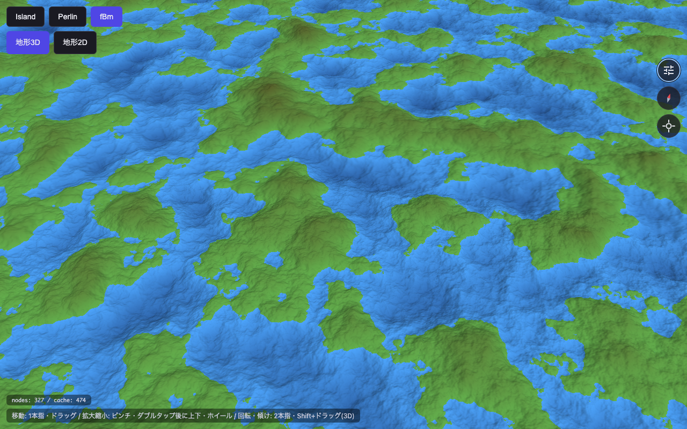

# Terrain Playground

地形生成アルゴリズムの実験場。アルゴリズムを実装しながら、生成結果を即座に見て確かめることを目的にしている。2D/3Dビュー、無限スクロール、LODによる高速描画等を備え、PC/モバイルブラウザで動作する。



> このスクリーンショットは `npm run shot` で生成している（[使い方](#開発コマンド)）。

## 技術スタック

- Node.js: `26.x`
  - Current 系（LTS ではない）。`.node-version` / `.tool-versions` で固定
- TypeScript: `6.x`
- Vite: `8.x`
- Vitest: `4.x`
- Playwright: `1.x`
  - 実ブラウザ（Chromium）で WebGL2 を描画しての E2E / 視覚回帰テスト
- Biome: `2.x`
  - linter / formatter（設定は `biome.json`）
- WebGL2
  - 地形メッシュ・タイルの描画基盤
- markdown-it / KaTeX / Mermaid
  - `docs/` のドキュメント図（Mermaid 関係図・LaTeX 数式・SVG 幾何図）を PNG に焼く `docs:render` 用（ランタイム依存ではない）

## セットアップ

```sh
npm install
npm run dev
open http://localhost:5173
```

## 使用方法

起動すると地形が表示される。上部のタブでアルゴリズムを、下部のタブで表示モードを切り替えられる。

- **地形3D**（デフォルト）: ハイトマップを地形メッシュとして立体表示。
  - ドラッグでパン / ホイールでズーム / Shift+ドラッグで回転。
- **地形2D**: ハイトマップを真上から色で表示（Google Maps 風のタイル LOD）。
  - ドラッグでパン / ホイールでズーム。

また、右上の設定アイコンをクリックすると、各種パラメータを変更できる。

## 開発方法

### 開発コマンド

```sh
# 開発サーバ起動（http://localhost:5173）
npm run dev

# LAN 内の他端末からアクセス可能にする場合
npm run dev -- --host 0.0.0.0

# 型チェック (tsc --noEmit) + 本番ビルド (dist/)
npm run build

# ビルド成果物をローカルで確認
npm run preview

# テスト（watch モード）
npm test

# テストを 1 回だけ実行
npm run test:run

# E2E / 視覚回帰テスト（Playwright で基準画像と比較）
npm run test:e2e

# README 用スクショ（screenshot.png）を生成
npm run shot

# docs/*.md の図（Mermaid 関係図・LaTeX 数式・SVG 幾何図）を PNG に焼いて目視確認（test-results/docs/ へ出力）
# --theme both で light/dark 両テーマ、--clip <CSSセレクタ> で図ごとに等倍抜き出し
npm run docs:render

# フォーマット（Biome で整形して上書き）
npm run format

# Lint（Biome で静的解析）
npm run lint

# フォーマット + Lint + import 整理をまとめて適用
npm run check
```

### ディレクトリ構成

`src/` は「誰が書く層か」を境界にして 3 つに分けている。

```
src/
├── algorithm/      # 地形生成アルゴリズム（人間が研究・実装する層）
│   ├── noise/      #   Perlin / fBm などのノイズ実装
│   ├── height.ts   #   高さ関数 HeightMapFunc = (x, z) => y の実装
│   └── generators.ts  # ジェネレータ（パラメータ定義 + ファクトリ）のレジストリ
├── visualization/  # 描画・UI（メッシュ生成・レンダリング・操作。AI 生成で広げる層）
│   ├── scenes/     #   2D/3D シーンと LOD
│   ├── gl/         #   WebGL2 ラッパ
│   ├── ui/         #   タブ・パラメータパネル・カメラ操作
│   ├── input/      #   ジェスチャ入力
│   └── shaders/    #   GLSL シェーダ
├── core/           # 両層が依存する基盤
│   ├── math/       #   行列・ベクトル・乱数などの数学 util
│   └── colormap.ts #   共有ドメイン定数を含む colormap
└── main.ts         # 上記を配線するエントリーポイント
```

依存方向は `visualization → algorithm → core` の一方向で、`algorithm` は `visualization` に依存しない。

**新しい地形アルゴリズムを足すとき**は `algorithm/` だけ触ればよい:

1. `algorithm/height.ts` に `makeXxxHeightMapFunc()`（`HeightMapFunc` を返す）を書く。
2. `algorithm/generators.ts` の `GENERATORS` に 1 エントリ（id・ラベル・パラメータ定義・`make()`）を追加する。

UI（タブ・スライダー）は `GENERATORS` の定義から自動で組み立てられるので、描画・UI 側のコードを書く必要はない。

E2E / 視覚回帰テストは `src/` とは別に `e2e/` に置く。

```
e2e/
├── regression.spec.ts  # 視覚回帰テスト（基準画像と比較）
├── readme-shot.spec.ts # README 用スクショ（screenshot.png）生成
├── helpers.ts          # 収束待ち・オーバーレイ非表示・描画固定のユーティリティ
└── regression.spec.ts-snapshots/  # 基準画像（コミットする）
```

seed を固定して高さ関数を決定的にし、描画の収束（`window.__terrain.settledFrames`）を待ってから描画ループを固定して `#gl` canvas を撮る。WebGL canvas をスクショで読めるよう、`src/visualization/gl/context.ts` の WebGL2 コンテキストは `preserveDrawingBuffer: true` にしている。

設計メモやアルゴリズムの解説は `docs/` に置く。図は「関係図 = Mermaid / 数式 = LaTeX / 幾何図 = SVG ファイル」の 3 層で描き、開発ツールの `docs:render`（`tools/render-doc.mjs`）で 1 枚の PNG に焼いてローカル目視できる。

```
docs/
├── *.md            # アルゴリズム・設計の解説（Mermaid / LaTeX を含む）
└── assets/         # ドキュメントから相対参照する SVG 幾何図

tools/
└── render-doc.mjs  # docs/*.md の図を PNG に焼く開発ツール（npm run docs:render）
```
