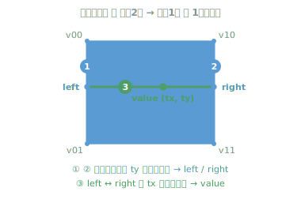
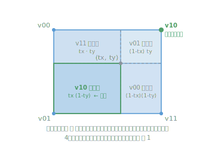

# 補間とイージング関数（interpolate / easing）まとめ

Perlin noise では、格子点（lattice）ごとに計算した値を、セル内の位置 `t (0〜1)` に
応じて混ぜ合わせる。この処理は **2つの役割** に分かれている。

- **補間（interpolation）** … 2つの値 `a`, `b` の間の値を求める。実装は
  [`interpolate()`](../src/algorithm/noise/perlin-noise.ts)。
- **イージング関数（easing function）** … `t` を `[0,1] → [0,1]` に曲げ直す
  「混ぜ具合のカーブ」。`interpolate` に `f` として渡す。型は
  [`EasingFunction`](../src/algorithm/noise/perlin-noise.ts)。

```ts
type EasingFunction = (t: number) => number;

function interpolate(a: number, b: number, t: number, f: EasingFunction): number {
  return a + (b - a) * f(t);
}
```

`f` に何を渡すかでカーブが変わる。このリポジトリでは
`easeLinear` / `easeSmoothstep` / `easeSmootherstep` の3つを用意している。

---

## 1. linear（線形補間 / lerp）— 1次

一番素朴な補間。`f(t) = t`（イージングなし）。

```
interpolate(a, b, t) = (b - a) * t + a
```

`t` がそのまま混ぜ具合（`t=0` → a, `t=1` → b）になっていて、**1次式（直線）**。
この `f = 恒等関数` の特殊形が、いわゆる **lerp**（linear interpolation）や
GLSL の **`mix`**。`interpolate` は `f` を引数に取る一般化版なので、`lerp` と呼ぶと
「線形限定」と誤解させる点に注意。

問題点: 格子の境界で **傾き（微分）が不連続**になる。
その結果、ノイズ画像に格子状のスジ（マッハバンド）が見えてしまう。

---

## 2. smoothstep — 3次（cubic）

線形補間の `t` の部分を `(3 - 2t)·t²` に置き換える。

```
interpolate(a, b, t) = (b - a) * (3 - 2t)·t² + a
                                 └── t の代わり ──┘
```

```ts
// 3t² - 2t³
export function easeSmoothstep(t: number): number {
  return t * t * (3 - 2 * t);
}
```

混ぜ具合の関数 `S(t) = (3 - 2t)·t²` を展開すると:

```
S(t) = 3t² - 2t³   ( = -2t³ + 3t² )
```

これが **3次式（cubic）**。

### なぜ3次なのか

`S(t)` に欲しい条件が **4つ**あるから。

| 条件        | 意味                             |
| ----------- | -------------------------------- |
| `S(0) = 0`  | t=0 のとき結果は a ちょうど      |
| `S(1) = 1`  | t=1 のとき結果は b ちょうど      |
| `S'(0) = 0` | 始点で傾きゼロ（なめらかに入る） |
| `S'(1) = 0` | 終点で傾きゼロ（なめらかに出る） |

条件が4つ → 未知数も4つ必要。
3次式 `S(t) = at³ + bt² + ct + d` はちょうど係数が4つ。
だから **条件をすべて満たせる最小の次数が3次**。

実際に解くと:

```
S(0)=0   →  d = 0
S'(0)=0  →  c = 0         ( S'(t) = 3at² + 2bt + c )
S(1)=1   →  a + b = 1
S'(1)=0  →  3a + 2b = 0
```

連立を解いて `a = -2, b = 3`、つまり:

```
S(t) = -2t³ + 3t² = (3 - 2t)·t²
```

`S'(0)=S'(1)=0` のおかげで、隣のセルとの境目でも傾きがなめらかにつながり、
グリッドの跡が見えなくなる。これが3次にする目的。GLSL/HLSL の組み込み関数
`smoothstep()` と同じ多項式。

---

## 3. smootherstep — 5次（quintic, Improved Perlin Noise 2002）

Ken Perlin の改良版。条件をさらに1段増やす。Perlin 自身はこれを **fade** と呼んだ。

```
S(t) = 6t⁵ - 15t⁴ + 10t³
```

```ts
// 6t⁵ - 15t⁴ + 10t³
export function easeSmootherstep(t: number): number {
  return t * t * t * (t * (t * 6 - 15) + 10);
}
```

### なぜ5次なのか

3次の4条件に加えて、**2階微分も両端で 0** にする。

| 条件       | 意味                |
| ---------- | ------------------- |
| `S(0)=0`   | 値                  |
| `S(1)=1`   | 値                  |
| `S'(0)=0`  | 1階微分（傾き）     |
| `S'(1)=0`  | 1階微分（傾き）     |
| `S''(0)=0` | 2階微分（曲がり方） |
| `S''(1)=0` | 2階微分（曲がり方） |

条件が6個 → 係数も6個必要 → **5次式（quintic）**。

2階微分まで連続（C² 連続）になるので見た目がさらになめらか。
3次版だと、ノイズの2階微分の不連続が陰影（特に法線を使う3D地形）で
微妙に見えることがあり、それが解消される。

---

## まとめ（次数と固定条件）

| 名前               | 式                  | 固定する条件（両端）   | 連続性 | 次数 |
| ------------------ | ------------------- | ---------------------- | ------ | ---- |
| `easeLinear`       | `t`                 | 値                     | C⁰     | 1次  |
| `easeSmoothstep`   | `3t² - 2t³`         | 値 + 1階微分           | C¹     | 3次  |
| `easeSmootherstep` | `6t⁵ - 15t⁴ + 10t³` | 値 + 1階微分 + 2階微分 | C²     | 5次  |

「両端で固定したい微分の階数が1つ増えるごとに、必要な次数が2つ上がる」
という関係になっている。次の段（3階微分まで固定）は7次の
`-20t⁷ + 70t⁶ - 84t⁵ + 35t⁴`。

---

## 双線形補間（bilinear interpolation）— 1次元補間を2次元へ

ここまでの `interpolate` は **1次元**（2点 a, b の間）の話。Perlin noise の格子セルは
4頂点あるので、この1次元補間を **縦横で組み合わせて** 2次元に拡張する。これが
**双線形補間（bilinear interpolation）**。「双（bi ＝ 2方向）に線形補間」の意味。

セル内のローカル座標 `(tx, ty)`（どちらも 0〜1）と、4頂点の値
`v00, v10, v01, v11` から内部の点の値を求める。実装は
[`PerlinNoise.get()`](../src/algorithm/noise/perlin-noise.ts)。



**`interpolate` を 3 回**で求まる（上辺 y=0 が `v00,v10`、下辺 y=1 が `v01,v11`）:

```ts
// 1. 縦方向に2回 → 左辺・右辺それぞれの点の値
const left  = interpolate(v00, v01, ty, fade); // 左辺 (x=0)
const right = interpolate(v10, v11, ty, fade); // 右辺 (x=1)
// 2. 横方向に1回 → その2点を混ぜる
const value = interpolate(left, right, tx, fade);
```

（コードの変数名では `left = value0001`, `right = value1011`。）

### 性質

**順序を入れ替えても結果は同じ** … 先に横→後で縦でも、同じ値になる。展開すると4頂点の
**重み付き平均**になり、左右対称だから:

$$
\text{value} = v_{00}(1-t_x)(1-t_y) + v_{10}\,t_x(1-t_y) + v_{01}(1-t_x)t_y + v_{11}\,t_x t_y
$$

各頂点の重みは「**対角にある頂点まで作る長方形の面積**」。近い頂点ほど重く、重みの合計は常に 1。



**各辺の上では1次元補間に一致** … 隣のセルとの境目が連続的につながる。

> Perlin noise では `tx, ty` を生のまま使わず、上のコードのように `fade` を通してから
> 補間している。そこが「ただの双線形補間」との違い。次のセクションへ。

---

## 名前の整理（fade / easing / smoothstep / interpolation）

同じ多項式が、分野によって違う名前で呼ばれる。混乱しやすいので対応表にしておく。

### 同じ関数が文脈で名前を変える

`6t⁵ - 15t⁴ + 10t³` を例にすると:

| 文脈              | 呼び方                            |
| ----------------- | --------------------------------- |
| Perlin noise      | **fade function**（原典の呼称）   |
| 補間一般          | 補間関数 / interpolant            |
| アニメーション/UI | **easing function**（一番通じる） |
| グラフィックス    | **smootherstep**（固有名）        |

### 役割を2層に分けて考える

```
interpolate(a, b, t, f)   ← 「a と b の間の値を出す」      = interpolation
         f(t)             ← 「t をどう 0→1 で動かすか」    = easing
```

- **`interpolate`（補間）** … `f = 恒等関数` の特殊形が `lerp` / GLSL `mix`。
  ここでは `f` を引数で受け取る一般化版なので、`lerp` ではなく `interpolate` が正確。
- **イージング関数 `f`** … `t` の曲げ方。`interpolate` の名前を補間側に使っている以上、
  `f` を "interpolation function" と呼ぶと衝突して紛らわしい。だから `f` は
  **easing function** と呼んで住み分ける。

### このコードの命名方針

- 型は役割で **`EasingFunction`**（`(t: number) => number`）。
- 関数名は一番分野横断で通じる **`ease*`**
  （`easeLinear` / `easeSmoothstep` / `easeSmootherstep`）。
  `linear` も easing の世界では「linear easing」とれっきとした呼称なので、
  3つまとめて `ease*` で揃えられる。
- ただし `PerlinNoise.get()` 内のローカル変数だけ **`fade`** を残している。
  Perlin 原典がこのカーブを fade と呼ぶため、「この補間で使う ease カーブ ＝
  Perlin でいう fade」というニュアンスをコードに残す意図。
- `smoothstep` は GLSL 組み込みと同じ多項式、`smootherstep` はその Perlin 改良版。

---

## 「双線形補間 + イージング」に名前はある？（Hermite / bicubic / cosine）

`tx, ty` を生のまま使わず `fade(tx)`, `fade(ty)` と **イージングを通してから** 双線形補間する、
というのが Perlin noise の補間の肝。この「双線形 + イージング」というセット**全体**に通る
固有名は実は無いが、**部品に分けると名前がつく**。

### 1次元の核「lerp + smoothstep」＝ 三次エルミート補間

端点の傾きを 0 にした **三次エルミート補間（cubic Hermite interpolation）** を展開すると、
ちょうど smoothstep が出てくる:

```
端点 p0(t=0), p1(t=1)、両端の傾き m0 = m1 = 0 のエルミート補間
h(t) = (2t³-3t²+1)·p0 + (-2t³+3t²)·p1
     = p0 + (p1-p0)·(3t²-2t³)
     = interpolate(p0, p1, smoothstep(t))   ← まさにこれ
```

つまり `interpolate + easeSmoothstep` は俗に **smoothstep interpolation**、正式には
**端点傾き 0 の三次エルミート補間**。`easeSmootherstep` の方はそれを5次に上げた版で、
固有名というより **Perlin's fade**（セクション3）と呼ばれることが多い。

### 2次元セット全体には固有名は無い

「双線形 + fade」のセットは、ノイズの文脈では単に **fade** / **smooth interpolation** /
「Perlin（gradient）noise の補間」と説明される程度で、決まった一語の名前は無い。

### 紛らわしい: これは bicubic ではない

名前が近いので混同しやすいが、**双三次補間（bicubic interpolation）とは別物**。

| | 使う点数 | 中身 |
| --- | --- | --- |
| この実装（双線形 + fade） | 4点 | 双線形のまま、補間パラメータ `t` だけを S 字に歪める |
| 双三次補間（bicubic） | 16点（4×4 近傍）or 微分 | 各軸を三次多項式そのもので補間 |

bicubic は周囲16点や微分情報を使う、もっと重い別手法。この実装は「4点の双線形は据え置きで、
`t` の曲げ方だけで滑らかさを稼ぐ」安価なテクニック。

### 兄弟分: コサイン補間

同じ「ease カーブを差し替える」発想の仲間に **コサイン補間（cosine interpolation）** がある。
`f(t) = (1 - cos(tπ)) / 2` をイージングに使う、value noise でよく出てくる古典手法。
smoothstep より計算は重め・滑らかさは smoothstep / smootherstep に劣るため、今は
smoothstep 系に置き換えられることが多い。

---

## 参考

- Ken Perlin, "Improving Noise" (SIGGRAPH 2002) — quintic fade（smootherstep）の出典
- `smoothstep` は GLSL/HLSL の組み込み関数 `smoothstep()` と同じ多項式
- smoothstep ＝ 端点傾き 0 の三次エルミート補間（cubic Hermite, zero tangents）の基底
- 双線形補間 / 双三次補間（bilinear / bicubic interpolation）は別物（点数と次数が違う）
- 実装: [src/algorithm/noise/perlin-noise.ts](../src/algorithm/noise/perlin-noise.ts) の `interpolate()` /
  `easeLinear` / `easeSmoothstep` / `easeSmootherstep`、双線形補間は
  `PerlinNoise.get()`
